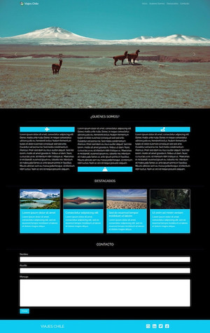

# Viajes Chile 
## Descubre la aventura de viajar
Enlace del proyecto -> [Aquí](https://german-rs.github.io/ViajesChile/) 

 En este trabajo la agencia Viajes Chile solicita la creación de una landing page, que tenga un "diseño atractivo e innovador", para lo cuál debia guiarme por la siguiente estructura:

Hace unos meses conocí el "Glass Morphism" cómo tendencia en el desarrollo de productos digitales y cómo en este trabajo se solicitaba un diseño atractivo e innovador quise aplicar ese estilo para esta landing.

El resultado final de este trabajo lo puedes ver en el siguiente [enlace.](https://german-rs.github.io/ViajesChile/)

Para este proyecto se utilizó:
<ul>
<li>HTML5</li>
<li>CSS</li>
<li>JavaScript</li>
<li>Bootstrap</li>
<li>JQuery</li>
<li>Google Fonts</li>
<li>Font Awesome</li>
</ul>

